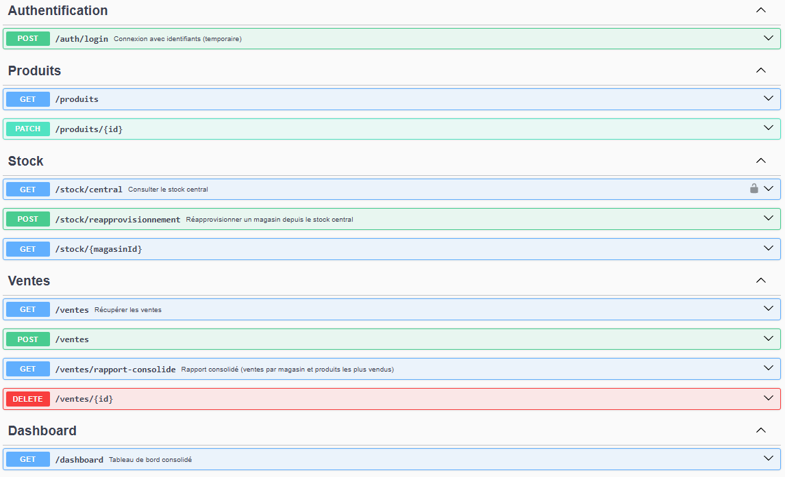

# Projet Multi-Magasins – API RESTful

**Cours :** Architecture Logicielle (LOG430)  
**Session :** Été 2025  
**Laboratoire 3 :** Exposition d’une API RESTful  
**Auteur :** Nathan Lamy

---

## Contexte

Ce projet s'inscrit dans la continuité du Laboratoire 2. Il vise à exposer les principales fonctionnalités métier d’un système multi-magasins à travers une API RESTful, en respectant les bonnes pratiques d’architecture logicielle et les principes REST.

---

## Objectifs d’apprentissage

- Concevoir une API RESTful respectant les bonnes pratiques  
- Séparer les couches de présentation, logique métier et persistance  
- Documenter les endpoints via Swagger (OpenAPI 3.0)  
- Implémenter des contrôleurs REST et services associés  
- Tester les endpoints (Postman + Jest)  
- Sécuriser les endpoints (CORS, JWT)  
- Intégrer les tests dans le pipeline CI/CD  

---

## Démarrage

### 1. Cloner le projet

```bash
git clone https://github.com/nathanlamy/LOG430-LABO-5
cd /LOG430-LABO-5/{service-name}
```

### 2. Installer les dépendances

```bash
npm install
npx prisma generate
```

### 3. Lancer l’application localement

```bash
npm run start
```

---

## Authentification

- **Type :** JWT  
- **Header :** Authorization: Bearer `<token>`

---

## Endpoints principaux



---

## Documentation Swagger

### Interfaces Swagger UI
- http://{ip-vm}:3001/api-produit
- http://{ip-vm}:3002/api-stock
- http://{ip-vm}:3003/api-vente
- http://{ip-vm}:3004/api-reporting

---

## Tests

```bash
npm run test
```

## Linter

```bash
npm run lint
```

---

## Cas d’usage implémentés

- La recherche de produits **(GET /produits)**
- L'enregistrement de ventes **(POST /ventes)**
- L'annulation de ventes **(DELETE /ventes/:id)**
- La consultation du stock **(GET /stock)**
- L'affichage des ventes **(GET /ventes)**
- La génération d’un rapport consolidé des ventes (UC1) **(GET /ventes/rapport-consolide)**
- La consultation du stock central et demandes de réapprovisionnement (UC2) **(GET /stock/reapprovisionnement)**
- La visualisation des performances globales (tableau de bord) (UC3) **(GET /dashboard)**
- Mise à jour des produits depuis la maison mère (UC4) **(PUT /produits/:id)**
- Approvisionnement depuis le centre logistique (UC6) **(POST /stock/approvisionnement)**

---

## Routes avec le gateway KrakenD

### Auth
- `POST http://{ip-vm}:8080/auth/login`

### Produits
- `GET http://{ip-vm}:8080/produits`
- `PATCH http://{ip-vm}:8080/produits/{id}`

### Ventes
- `GET http://{ip-vm}:8080/ventes`
- `POST http://{ip-vm}:8080/ventes`
- `DELETE http://{ip-vm}:8080/ventes/{id}`
- `GET http://{ip-vm}:8080/ventes/rapport-consolide`

### Stock
- `GET http://{ip-vm}:8080/stock`
- `POST http://{ip-vm}:8080/stock/reapprovisionnement`
- `GET http://{ip-vm}:8080/stock/{magasinId}`

### Rapport
- `GET http://{ip-vm}:8080/rapport`

---

## Postman
- Importer le fichier `LOG430-LABO-5.postman_collection.json` dans Postman
---
## Sécurité

- CORS activé  
- Authentification JWT

---

## Bonnes pratiques REST suivies

- URIs orientées ressource : `/stock`, `/ventes`, `/dashboard`, `/produits`
- Verbes HTTP respectés : GET, POST, DELETE  
- Statuts HTTP clairs : 200, 201, 204, 400, 404  
- Erreurs formatées comme :

```json
{
  "timestamp": "2025-06-02T10:21:00Z",
  "status": 400,
  "error": "Bad Request",
  "message": "Le champ ‘produitId’ est requis.",
  "path": "/stock/reapprovisionner"
}
```

---

## Auteur

- Nathan Lamy  
- Étudiant LOG430 – ÉTS Montréal  
- Été 2025

---